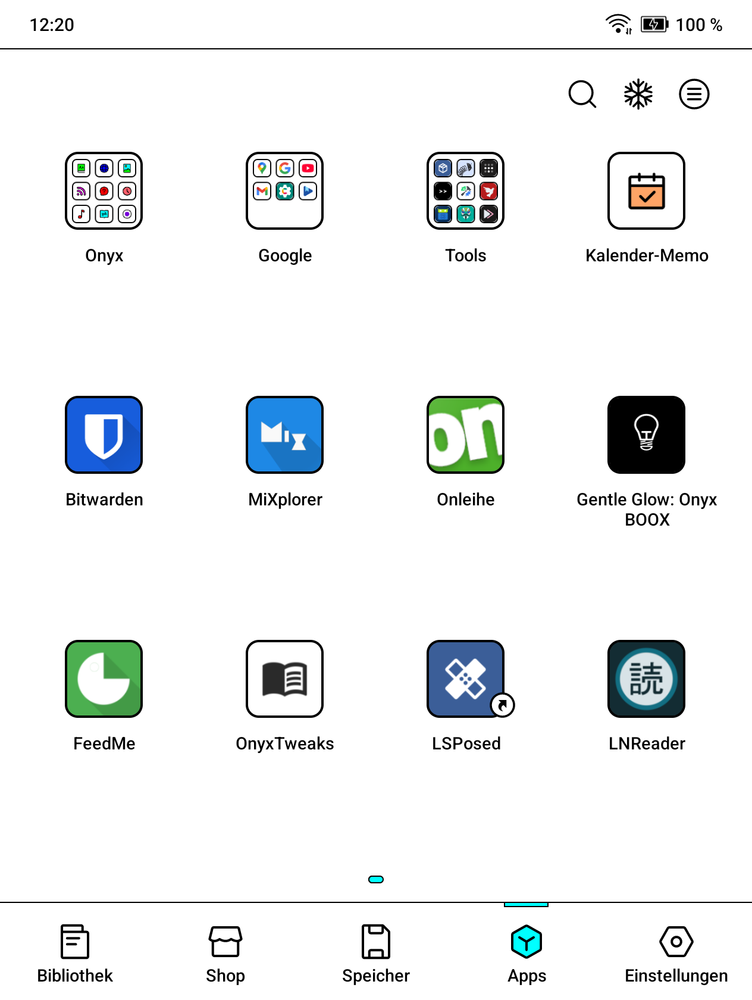
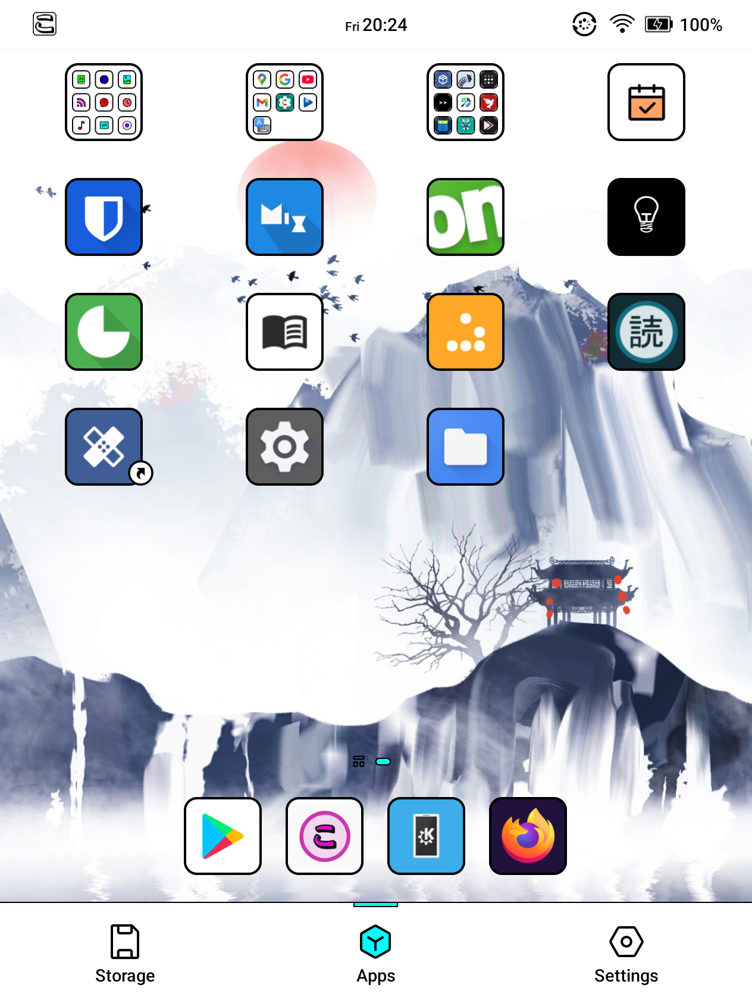
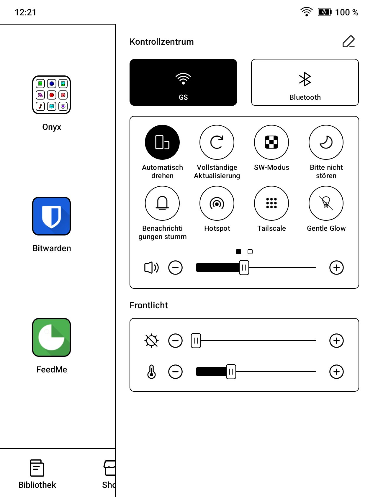
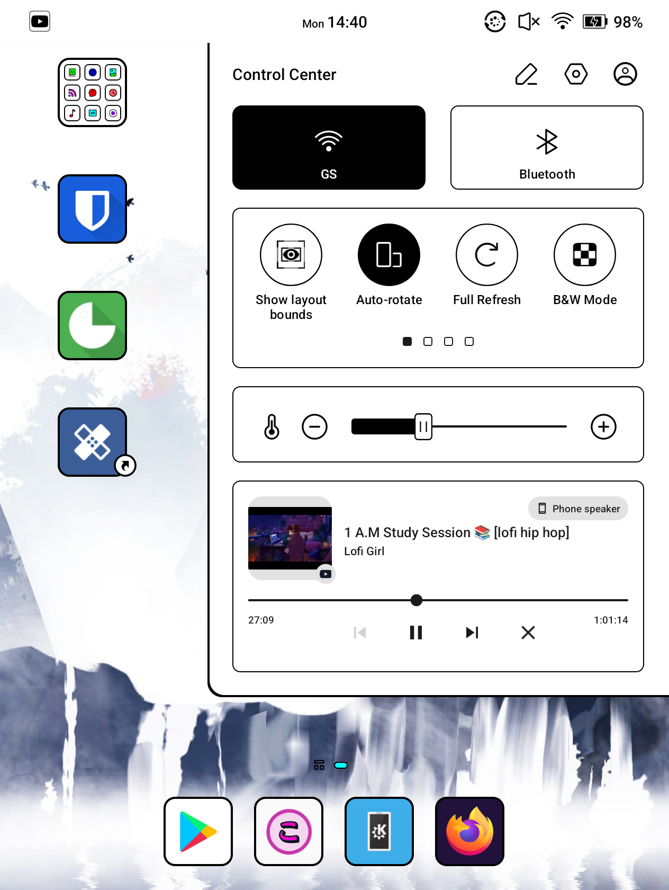
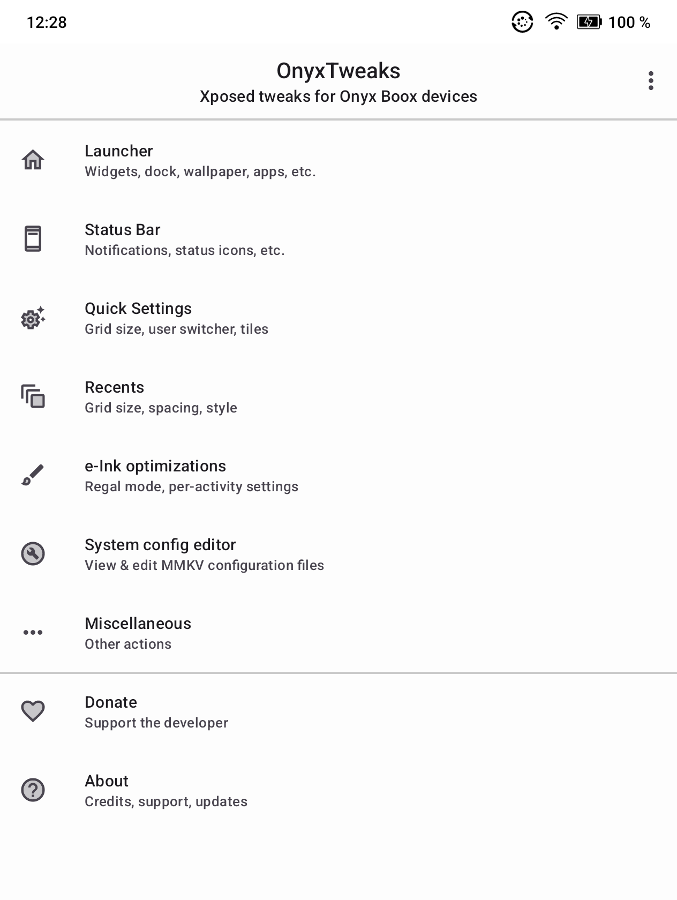
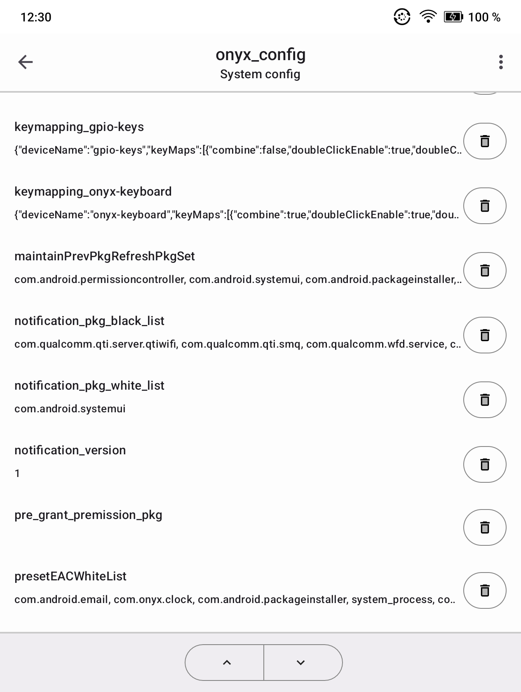
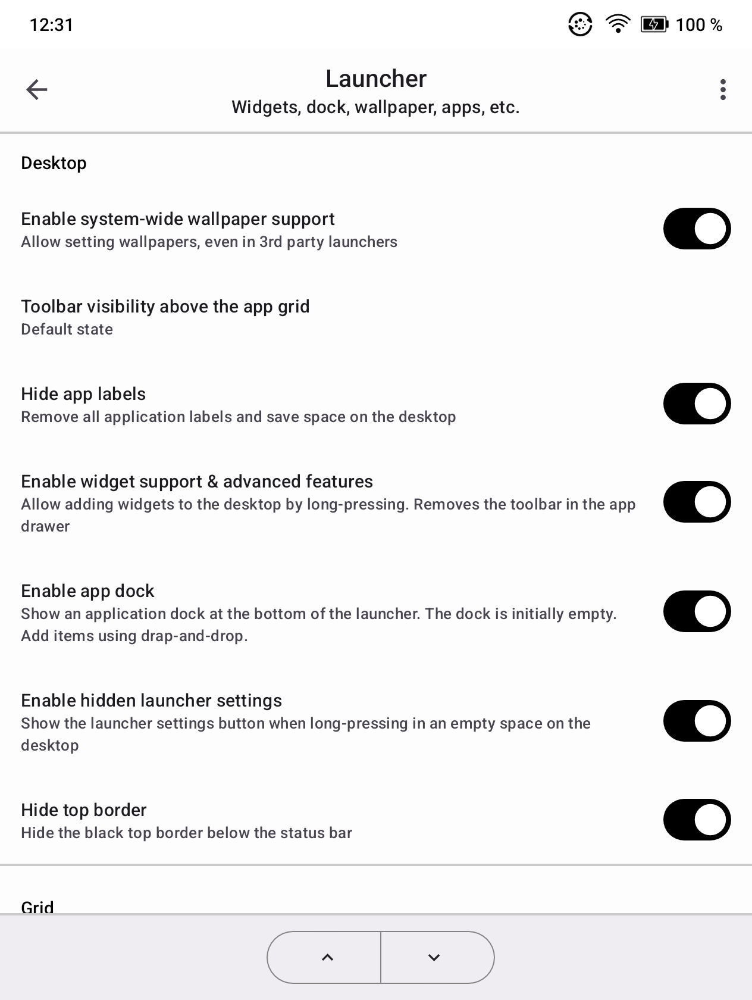
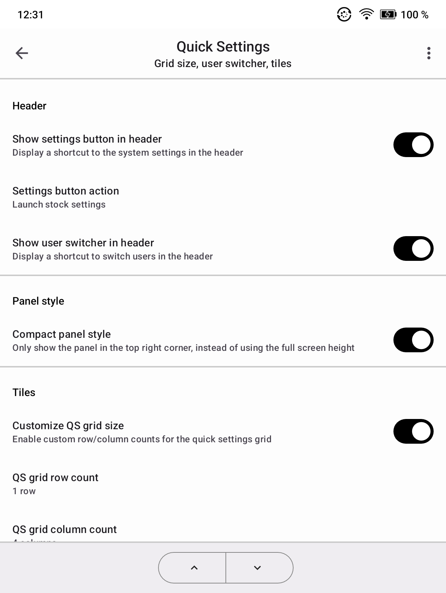

<!--suppress CheckImageSize, HtmlDeprecatedAttribute, HtmlUnknownAnchorTarget -->
<h1 align="center">
  
   
  OnyxTweaks
   
</h1>
<h4 align="center">Xposed module for modding the Onyx Boox Go Color 7 (Android 12) and similar devices</h4>

  
  <!---->
  

  <a href="#compatibility">Compatibility</a> •
  <a href="#features">Features</a> •
  <a href="#downloads">Downloads</a> •
  <a href="#screenshots">Screenshots</a>

   
   

   
   

  Before vs. after

## Compatibility

> [!CAUTION]
> This Xposed module was primarily designed for my Go Color 7 running the Beta 4.0 firmware with Android 12. 
> I cannot guarantee full compatibility with other Boox models, especially if they do not run the 4.0 beta firmware.

## Features

This module unlocks several features that are only available on high-end devices with screens larger than my Go Color 7. It also adds other mods to the SystemUI, Android Framework, and Onyx Launcher.

### Onyx Launcher

Widgets
* Unlock widget support on all devices
* Unlock smart assistant (dedicated launcher page for widgets); also allows non-Onyx widgets to be added

Desktop
* Unlock the app dock on all devices
* Wallpaper support (including in 3rd-party launchers)
* Customize dock & desktop grid size
* Show hidden apps (Android stock settings, stock file manager, etc.)
* Hide app labels

Function bar
* Hide function bar items (Shop, Library, etc)
* Change function bar item alignment & position

Onyx settings
* Show physical keyboard/mouse settings section on all devices
* Add additional shortcuts to App settings, app freeze manager, screensaver, and app usage statistics

### Status Bar

Notifications
* Enable heads-up notifications
* Set maximum visible notification icons
* Remove notification icon borders
* Fix invisible/white-on-white notification icons
* ...and minor notification panel changes

Clock
* Customize clock position (left, center, right)
* Insert day of the week, or your custom dynamic text (ex. with the current date) next to the clock (in small or normal font size)

Status icons
* Show current e-Ink refresh mode as a status icon
* Show current touch/stylus mode as a status icon
* Hide wi-fi activity indicators (arrows)

### Quick settings

Header
* Show user switcher button
* Show the settings button, and optionally redirect to Android's stock settings

Panel
* Inject Android's media controls into the QS panel (seek bar, play/pause buttons, etc. for music apps)
* Hide panel components (WiFi/BT tiles, tile grid, front-light sliders, volume slider, etc.)
* Compact panel style (top right only, instead of using the full-screen height)
* Customize QS grid size
* Remove minimum tile count restriction 

Tiles 
* Show Black & white mode tile on all devices
* Show split screen tile on all devices

### Recents

* Customize grid size & spacing
* Restore stock Android item header styles

### System settings

* Show stock Android gesture settings (one-handed mode, power button gestures)
* Show memory info in app info

### e-Ink optimizations

* Allow regal mode everywhere, for example, in certain system apps
* Unlock the e-Ink optimization menu in all apps
* Assign different refresh modes to each activity within an app
   * For example, you could set it up to switch to Regal mode when an app has its reader activity open and use fast mode for the book library screens, which might feature lots of scrolling elements & lists.

### MMKV system config editor

The app also includes an editor for the MMKV file format. It is used in Onyx apps and by the system to store configuration data.

This component works without Xposed but requires root access.

## Downloads

> [!IMPORTANT]
> To use this module, you must root your device using Magisk. See the [mobileread.com](https://www.mobileread.com/forums/forumdisplay.php?f=220) forum for guides & support.
> Then enable Zygisk in Magisk Manager and install the [LSPosed Magisk module](https://github.com/JingMatrix/LSPosed/releases).

See [releases](https://github.com/timschneeb/OnyxTweaks) for module downloads.

This module is also published in the LSPosed module repository and can be downloaded within LSPosed Manager.

## Reporting issues

Before reporting crashes or issues, please retrieve the Xposed log files from LSPosed manager.

On the 'Log' page of LSPosed manager, tap on the save icon in the top toolbar to save all important diagnostic data into a compressed file.
When opening an issue, please attach that file.

## Screenshots

   
   
   
   

## Acknowledgements

* Status bar clock related mods were adapted from: [PixelXpert](https://github.com/siavash79/PixelXpert/) by [siavash79](https://github.com/siavash79/)

<!--TODO
This app is available for free on Google Play: [https://play.google.com/store/apps/details?id=me.timschneeberger.onyxtweaks](https://play.google.com/store/apps/details?id=me.timschneeberger.onyxtweaks)

Also available on F-Droid: https://f-droid.org/packages/me.timschneeberger.onyxtweaks/

-->
